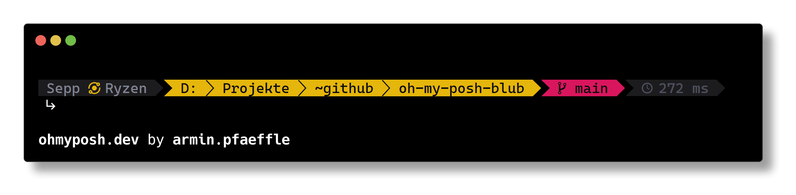

# blub ‒ a oh-my-posh v3 Theme

A colleague told me how easy it can be to setup an own theme for oh-my-posh. After a quick installation and after some hours spending on the fine tuning, I am very happy about having an own version, a version the highlights the most relevant parts (for me!).

This is how it looks like:

If you want to know how to setup oh-my-posh, you can read my very compact article: [Setting up oh-my-posh v3 for Windows Terminal](https://blog.armin-pfaeffle.de/2022/01/setting-up-oh-my-posh-v3-for-windows-terminal/)